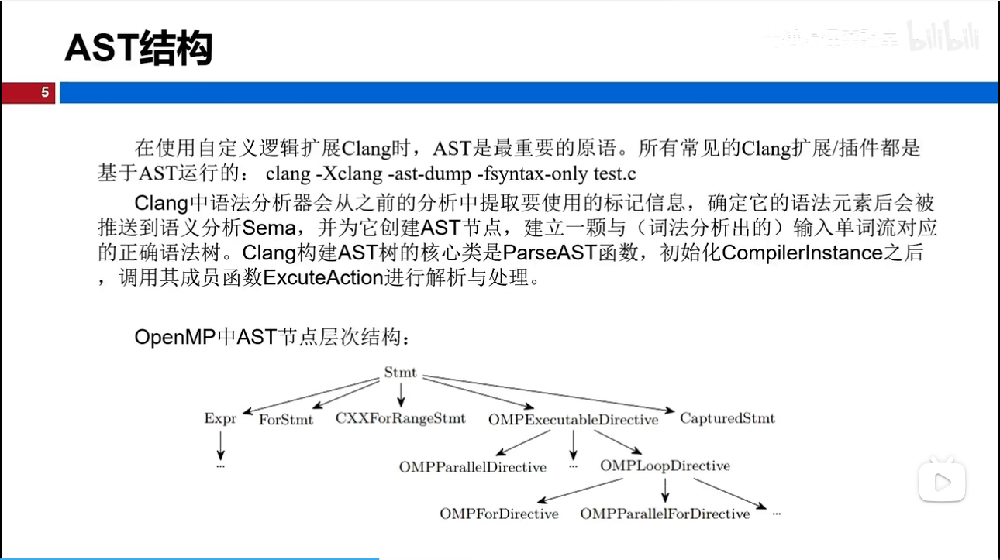

### gdb clang

```shell
set args -S -emit-llvm ACT_PROJECT/single-test/test.c -o -


```


### bt

```shell
(gdb) bt                                                                                                  #0  clang::ParseAST (S=..., PrintStats=false, SkipFunctionBodies=false)                                at /tmp/pengbenkang/LLVM/clang/lib/Parse/ParseAST.cpp:162                                                #1  0x0000000005a3cb14 in clang::ASTFrontendAction::ExecuteAction (this=0x1298ef10)                                                                              at /tmp/pengbenkang/LLVM/clang/lib/Frontend/FrontendAction.cpp:1173                                                                                      #2  0x0000000006410db3 in clang::CodeGenAction::ExecuteAction (this=0x1298ef10)                                                                                  at /tmp/pengbenkang/LLVM/clang/lib/CodeGen/CodeGenAction.cpp:1207                                                                                        #3  0x0000000005a3c463 in clang::FrontendAction::Execute (this=0x1298ef10)                                                                                       at /tmp/pengbenkang/LLVM/clang/lib/Frontend/FrontendAction.cpp:1059                                                                                      #4  0x00000000059749c0 in clang::CompilerInstance::ExecuteAction (this=0x12988f70, Act=...)                                                                      at /tmp/pengbenkang/LLVM/clang/lib/Frontend/CompilerInstance.cpp:1053                                                                                    #5  0x0000000005bcb7cc in clang::ExecuteCompilerInvocation (Clang=0x12988f70)                                                                                    at /tmp/pengbenkang/LLVM/clang/lib/FrontendTool/ExecuteCompilerInvocation.cpp:272                           #6  0x00000000029a8a6d in cc1_main (Argv=..., Argv0=0x12983f88 "/data2/pengbenkang/LLVM/build/bin/clang-17",                                                                                           MainAddr=0x29983b1 <GetExecutablePath(char const*, bool)>)                                                     
    at /tmp/pengbenkang/LLVM/clang/tools/driver/cc1_main.cpp:249                                                                                
#7  0x0000000002999c90 in ExecuteCC1Tool (ArgV=..., ToolContext=...)                                                                                         
    at /tmp/pengbenkang/LLVM/clang/tools/driver/driver.cpp:366                                                                                               
#8  0x0000000002999e61 in <lambda(llvm::SmallVectorImpl<char const*>&)>::operator()(llvm::SmallVectorImpl<char const*> &) const (__closure=0x7fffffffd350, ArgV=...)                          
    at /tmp/pengbenkang/LLVM/clang/tools/driver/driver.cpp:506                                                 
#9  0x000000000299b409 in llvm::function_ref<int(llvm::SmallVectorImpl<char const*>&)>::callback_fn<clang_main(int, char**, const llvm::ToolContext&)::<lambda(llvm::SmallVectorImpl<char const*>&)> >(intptr_t, llvm::SmallVectorImpl<char const*> &) (callable=140737488343888, params#0=...)
    at /tmp/pengbenkang/LLVM/llvm/include/llvm/ADT/STLFunctionalExtras.h:45      
#10 0x00000000057ffc37 in llvm::function_ref<int (llvm::SmallVectorImpl<char const*>&)>::operator()(llvm::SmallVectorImpl<char const*>&) const (this=0x7fffffffc3d8, params#0=...)
    at /tmp/pengbenkang/LLVM/llvm/include/llvm/ADT/STLFunctionalExtras.h:68
#11 0x00000000057feb24 in clang::driver::CC1Command::<lambda()>::operator()(void) const (
    __closure=0x7fffffffbf10) at /tmp/pengbenkang/LLVM/clang/lib/Driver/Job.cpp:440
#12 0x00000000057fef42 in llvm::function_ref<void()>::callback_fn<clang::driver::CC1Command::Execute(llvm::ArrayRef<std::optional<llvm::StringRef> >, std::string*, bool*) const::<lambda()> >(intptr_t) (callable=140737488338704)
    at /tmp/pengbenkang/LLVM/llvm/include/llvm/ADT/STLFunctionalExtras.h:45
#13 0x0000000003a2c9f6 in llvm::function_ref<void ()>::operator()() const (this=0x7fffffffba40)
---Type <return> to continue, or q <return> to quit---
    at /tmp/pengbenkang/LLVM/llvm/include/llvm/ADT/STLFunctionalExtras.h:68
#14 0x0000000004ac6ad8 in llvm::CrashRecoveryContext::RunSafely(llvm::function_ref<void ()>) (
    this=0x7fffffffbad0, Fn=...)
    at /tmp/pengbenkang/LLVM/llvm/lib/Support/CrashRecoveryContext.cpp:426
#15 0x00000000057fed10 in clang::driver::CC1Command::Execute (this=0x12988b10, Redirects=..., 
    ErrMsg=0x7fffffffbfa8, ExecutionFailed=0x7fffffffbfa7)
    at /tmp/pengbenkang/LLVM/clang/lib/Driver/Job.cpp:440
#16 0x00000000057a0ee0 in clang::driver::Compilation::ExecuteCommand (this=0x129829f0, C=..., 
    FailingCommand=@0x7fffffffc088: 0x0, LogOnly=false)
    at /tmp/pengbenkang/LLVM/clang/lib/Driver/Compilation.cpp:199
#17 0x00000000057a1219 in clang::driver::Compilation::ExecuteJobs (this=0x129829f0, Jobs=..., 
    FailingCommands=..., LogOnly=false)
    at /tmp/pengbenkang/LLVM/clang/lib/Driver/Compilation.cpp:253
#18 0x00000000057b2ef0 in clang::driver::Driver::ExecuteCompilation (this=0x7fffffffc2b0, C=..., 
    FailingCommands=...) at /tmp/pengbenkang/LLVM/clang/lib/Driver/Driver.cpp:1903
#19 0x000000000299afbd in clang_main (Argc=6, Argv=0x7fffffffd638, ToolContext=...)
    at /tmp/pengbenkang/LLVM/clang/tools/driver/driver.cpp:542
#20 0x00000000029cb25c in main (argc=6, argv=0x7fffffffd638)
    at /tmp/pengbenkang/LLVM/build/tools/clang/tools/driver/clang-driver.cpp:15
```


### gpt

我来帮你为Clang添加tensor扩展的AST解析支持。我们需要以下步骤:

1. 首先定义Tensor相关的AST节点类型
2. 修改词法分析器识别tensor关键字
3. 修改语法分析器支持tensor声明和初始化语法
4. 实现类型检查

让我们从第一步开始:

1. 在 clang/include/clang/AST/Type.h 中添加TensorType:

```cpp
/// TensorType - Represents a tensor type with dimensions
class TensorType : public Type {
  QualType ElementType; // Element type (e.g. double)
  llvm::SmallVector<unsigned, 4> Dimensions; // Tensor dimensions

public:
  TensorType(QualType ElemTy, ArrayRef<unsigned> Dims, QualType CanonicalTy)
    : Type(TensorTyKind, CanonicalTy, /*Dependent=*/false,
           /*InstantiationDependent=*/false,
           /*VariablyModified=*/false,
           /*ContainsUnexpandedParameterPack=*/false),
      ElementType(ElemTy),
      Dimensions(Dims.begin(), Dims.end()) {}

  QualType getElementType() const { return ElementType; }
  ArrayRef<unsigned> getDimensions() const { return Dimensions; }

  static bool classof(const Type *T) {
    return T->getTypeClass() == TensorTyKind;
  }
};
```

2. 在 clang/include/clang/Basic/TokenKinds.def 中添加tensor关键字:

```cpp
KEYWORD(tensor                    , KEYALL)
```

3. 在 clang/include/clang/Parse/Parser.h 中添加解析方法:

```cpp:clang/include/clang/AST/ASTContext.h
class Parser {
  // ...
  
  /// ParseTensorDeclarator - Parse a tensor declarator
  void ParseTensorDeclarator(Declarator &D);
  
  /// ParseTensorDimensions - Parse tensor dimensions like [2][2]
  bool ParseTensorDimensions(SmallVectorImpl<unsigned> &Dims); 
};
```

4. 在 clang/lib/Parse/Parser.cpp 中实现解析:

```cpp
void Parser::ParseTensorDeclarator(Declarator &D) {
  // Parse tensor dimensions
  SmallVector<unsigned, 4> Dims;
  if (!ParseTensorDimensions(Dims))
    return;

  // Create tensor type
  QualType ElemTy = Context.DoubleTy; // Default to double
  QualType TensorTy = Context.getTensorType(ElemTy, Dims);
  
  // Set type in declarator
  D.setType(TensorTy);
}

bool Parser::ParseTensorDimensions(SmallVectorImpl<unsigned> &Dims) {
  while (Tok.is(tok::l_square)) {
    ConsumeBracket(); // Eat [
    
    ExprResult SizeExpr = ParseConstantExpression();
    if (SizeExpr.isInvalid())
      return false;
      
    // Get dimension size
    llvm::APSInt Size;
    if (!SizeExpr.get()->isIntegerConstantExpr(Size, Context)) {
      Diag(SizeExpr.get()->getBeginLoc(), 
           diag::err_tensor_dimension_not_integer_constant);
      return false;
    }
    
    Dims.push_back(Size.getZExtValue());
    
    ExpectAndConsume(tok::r_square); // Expect and eat ]
  }
  
  return true;
}
```

5. 在 clang/include/clang/AST/ASTContext.h 中添加创建tensor类型的方法:

```cpp
class ASTContext {
public:
  QualType getTensorType(QualType ElemTy, ArrayRef<unsigned> Dims);
};
```

这是第一步实现,主要完成了:

1. 定义了TensorType AST节点
2. 添加了tensor关键字
3. 实现了基本的语法解析支持

接下来我们需要:

1. 实现类型检查
2. 支持tensor初始化
3. 添加语义分析

你觉得这个方向如何?我们可以继续完善这些功能。

好的,让我们继续完善tensor的实现。

1. 首先在 clang/include/clang/AST/TypeNodes.def 中添加TensorType节点定义:

```cpp:clang/include/clang/AST/TypeNodes.def
// ... existing code ...
TYPE(Tensor,            Type)    // TensorType
// ... existing code ...
```

2. 在 clang/lib/AST/ASTContext.cpp 中实现getTensorType:

```cpp:clang/lib/AST/ASTContext.cpp
QualType ASTContext::getTensorType(QualType ElemTy, ArrayRef<unsigned> Dims) {
  // Check if element type is valid (should be double)
  if (!ElemTy->isDoubleType()) {
    return QualType();
  }

  // Create canonical type
  QualType CanonicalTy = getCanonicalType(ElemTy);
  
  // Create new TensorType
  TensorType *T = new (*this) TensorType(ElemTy, Dims, CanonicalTy);
  
  return QualType(T, 0);
}
```

3. 在 clang/lib/Sema/SemaDecl.cpp 中添加tensor声明的语义检查:

```cpp:clang/lib/Sema/SemaDecl.cpp
bool Sema::CheckTensorDeclaration(VarDecl *VD, QualType &T) {
  if (const TensorType *TT = T->getAs<TensorType>()) {
    // Check dimensions are valid (non-zero)
    for (unsigned Dim : TT->getDimensions()) {
      if (Dim == 0) {
        Diag(VD->getLocation(), diag::err_tensor_zero_dimension);
        return false;
      }
    }
    
    // Check element type is double
    QualType ElemTy = TT->getElementType();
    if (!ElemTy->isDoubleType()) {
      Diag(VD->getLocation(), diag::err_tensor_element_not_double);
      return false;
    }
  }
  return true;
}
```

4. 在 clang/lib/Sema/SemaInit.cpp 中添加tensor初始化检查:

```cpp:clang/lib/Sema/SemaInit.cpp
bool Sema::CheckTensorInitialization(const InitializedEntity &Entity,
                                   InitListExpr *IList) {
  QualType DeclType = Entity.getType();
  const TensorType *TT = DeclType->getAs<TensorType>();
  if (!TT)
    return false;

  // Get tensor dimensions
  ArrayRef<unsigned> Dims = TT->getDimensions();
  
  // Check number of initializer elements matches dimensions
  unsigned TotalSize = 1;
  for (unsigned Dim : Dims)
    TotalSize *= Dim;
    
  if (IList->getNumInits() != TotalSize) {
    Diag(IList->getBeginLoc(), 
         diag::err_tensor_incorrect_number_initializers)
      << TotalSize << IList->getNumInits();
    return false;
  }
  
  // Check each initializer is a double constant
  for (unsigned i = 0; i < IList->getNumInits(); ++i) {
    Expr *Init = IList->getInit(i);
    if (!Init->isDoubleConstant()) {
      Diag(Init->getBeginLoc(),
           diag::err_tensor_initializer_not_double_constant);
      return false;  
    }
  }
  
  return true;
}
```

5. 在 clang/include/clang/Basic/DiagnosticSemaKinds.td 中添加相关诊断信息:

```cpp:clang/include/clang/Basic/DiagnosticSemaKinds.td
// Tensor related diagnostics
def err_tensor_zero_dimension : Error<
  "tensor dimension cannot be zero">;
def err_tensor_element_not_double : Error<
  "tensor elements must be of type double">;
def err_tensor_incorrect_number_initializers : Error<
  "tensor initializer has %0 elements but %1 were provided">; 
def err_tensor_initializer_not_double_constant : Error<
  "tensor initializer must be a double constant">;
def err_tensor_dimension_not_integer_constant : Error<
  "tensor dimension must be an integer constant expression">;
```

6. 在 clang/lib/Parse/ParseDecl.cpp 中添加tensor声明解析:

```cpp:clang/lib/Parse/ParseDecl.cpp
void Parser::ParseDeclaration(DeclaratorContext Context) {
  // ... existing code ...
  
  if (Tok.is(tok::kw_tensor)) {
    // Consume 'tensor' token
    ConsumeToken();
    
    // Parse declarator
    Declarator D(DS, Context);
    ParseTensorDeclarator(D);
    
    // Parse initializer if present
    if (Tok.is(tok::equal)) {
      ConsumeToken();
      ExprResult Init = ParseInitializer();
      if (Init.isInvalid())
        return;
      D.setInitializer(Init.get());
    }
    
    // Create declaration
    Decl *decl = Actions.ActOnDeclarator(getCurScope(), D);
    if (decl)
      Actions.FinalizeDeclaration(decl);
  }
  
  // ... existing code ...
}
```

这些修改添加了:

1. TensorType节点的完整定义和创建
2. Tensor声明和初始化的语义检查
3. 相关的错误诊断信息
4. 完整的解析支持

现在应该可以解析像这样的tensor声明:

```cpp
tensor a[2][2] = {{1.0, 2.0}, {3.0, 4.0}};
```

还需要添加什么功能吗?比如:
- tensor运算支持
- 类型转换规则
- 更多的初始化语法
- 其他tensor相关的语言特性
