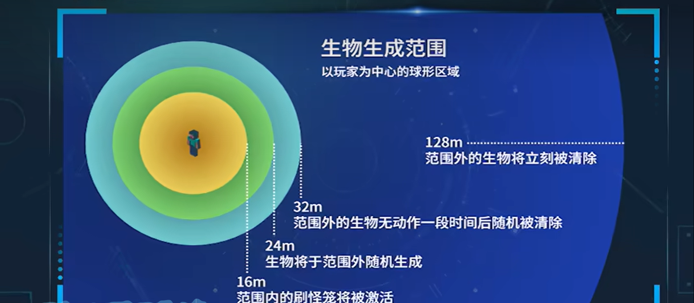

[toc]

### 刷线机

[图酱](https://www.bilibili.com/video/BV12e41157MH/?spm_id_from=333.999.0.0&vd_source=da5120fea3f8bb8d2fe1984a02a9a745)

如果不行，就换个方向，刷线机开口朝北或朝西。(今天看视频，说面朝东边或北边，众说纷纭——2024年6月30日)

### 刷铁机

[川川刷铁机](https://www.bilibili.com/video/BV1Ed4y1L7w9/?share_source=copy_web&vd_source=dafafdec1805b35b4a99583c19bd6bbf)

### 寻找末影珍珠

去地狱的诡异森林(`/locate biome minecraft:warped_forest`)，视线看向小黑，激怒并用船困住小黑。

[狩猎末影珍珠 - 我的世界生存技巧  精准空降到 04:09](https://www.bilibili.com/video/BV1hh411i7dS/?share_source=copy_web&vd_source=dafafdec1805b35b4a99583c19bd6bbf&t=249)

### 小黑塔

[经验花不完！！版本通用简单高效小黑塔速成]( https://www.bilibili.com/video/BV1CK421y73M/?share_source=copy_web&vd_source=dafafdec1805b35b4a99583c19bd6bbf)

### 物品运输与分离

[我的世界 川川 物品收集与分类指南-漏斗特性/分类机原理/物品运输/打包机选择/实例演示](https://www.bilibili.com/video/BV1PQ4y1C7Rp/?share_source=copy_web&vd_source=dafafdec1805b35b4a99583c19bd6bbf)

### 村民繁殖

[怎样无限繁殖村民](https://www.bilibili.com/video/BV1JV411a7dB/?share_source=copy_web&vd_source=dafafdec1805b35b4a99583c19bd6bbf)

打开村民繁殖信息：`/track villager breeding`

关闭村民繁殖信息：`/track villager clear`

### 猪人塔

[我的世界：java版猪人塔，无红石，搭一些方块就行](https://www.bilibili.com/video/BV1134y1Y7dE/?share_source=copy_web&vd_source=dafafdec1805b35b4a99583c19bd6bbf) 

图酱的视频中有个点没讲到：猪人塔要建在下界荒地，否则效率会很低或者不刷猪人。

[黑山大叔](https://www.bilibili.com/video/BV1a64y1C7Za/?share_source=copy_web&vd_source=dafafdec1805b35b4a99583c19bd6bbf)

