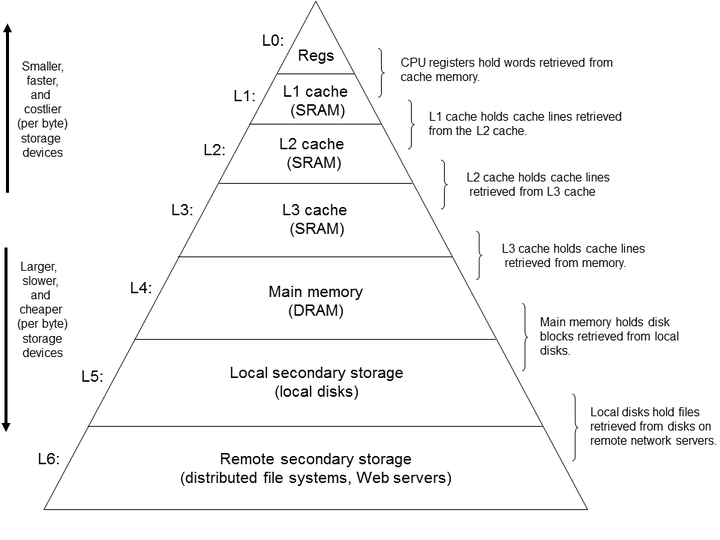

# 第一章 计算机系统漫游

* 信息就是位＋上下文
* 预处理→编译→汇编→链接：预处理是将库文件加载进源程序，例如将`iostream`库文件直接插入到程序文本中，结果得到一个新的程序文本文件,后缀通常为`.i`。编译是编译器`ccl`将程序文本`.i`文件翻译成汇编语言`.s`文件。汇编是汇编器(`as`)将`.s`文件翻译成机器指令(二进制)`.o`文件。链接将标准函数库中的`.o`合并进来，例如代码中调用了`printf`函数，链接器就要将汇编好了的`printf.o`链接进来。
* 存储器层次结构：



* L4就是常说的主存(或者说内存)，L5是外存(例如固态硬盘)。
* 进程是操作系统对一个正在运行的程序的抽象，一个系统可以同时运行多个进程，这种看上去多进程是并发进行的现象，实则是由**上下文切换**实现的。
* 进程间的切换是由内核(kernel)管理的，内核是操作系统常驻主存的部分。
* **一个进程可以由多个线程**组成。由于多线程之间比多进程之间更容易共享数据，因此**线程并行**更容易实现且更高效。
* **并发（Concurrency）与并行（Parallelism）**：并发指在同一时间段内，两个或多个任务都在进行，但不一定同时发生。在**单核**处理器上，只有一个任务在任意时刻真正执行，而其他任务处于暂停状态。这通过任务之间**快速切换**给予了“看似同时执行”的错觉。并行是指在同一时刻，有多个任务真正同时执行。这通常需要多核（或多处理器）系统，其中每个核心可以同时执行一个不同的任务。简而言之，并发是关于任务执行的管理和调度，并行是关于同时执行多个任务的能力。
* **进程（Process）与线程（Thread）**：进程是系统进行资源分配和独立运行的基本单位。每个进程都有自己的独立内存空间和系统资源。线程是进程中的执行单元，是进程内部的实际运行单位，处理器调度执行的最小单位。同一进程中的线程共享该进程的内存空间和资源，这使得线程之间的通信和数据共享变得容易，但也需要处理好同步和数据一致性的问题。

# 第二章 信息的表示和处理

* `size_t`即`max——type(int , char , long ……)` ，即所有数据类型中字节数最大的一个。一般地，`short`占2字节，`int`占4字节，`double`占8字节，所以一般的机器中，**`size_t`是字节数为8的``unsigned int ``** . `size_t`的作用就是设置一个当前机器最大的、无符号的整数数据类型。

```cpp
    size_t x = 114514 ;
    std::cout << "x = " << x << "  sizeof(size_t) = " << sizeof(size_t) << std::endl ;
```

> x = 114514  sizeof(size_t) = 8

* IEEE 浮点表示

$V = (-1)^s×M×2^E$  M是尾数(significand)、E是阶码(exponent)，$M=1+f$,这种表达叫做隐含的以1开头表示(implied leading 1).$E=e-Bias , Bias = 2^{k-1}-1$,其中e是无符号数，位表示为$e_{k-1}…e_0$，$Bias$为偏置，对于单精度为127，双精度为1023.

单精度浮点：32位，其中s占1位，exp占8位，frac占23位。

双精度浮点：64位，其中s占1位，exp占11位，frac占52位。

举例：3.14的单精度表达：①先将3.14转换为二进制表达，整数部分`3`的二进制表达为`11`,小数部分`.14`用乘二取整法得出二进制表达约为`.001001111`,所以$(3.14)_D = (11.001001111)_B$ ;②表示为规范化形式$1.xxx×2^x$的形式 ， $(11.001001111)_B = 1.1001001111×2^1$；③计算指数、尾数和符号位。符号位S=0 , 指数e = E + bias = 1 + 127 = 128 = $(1000\_0000)_2$ , 尾数M=$23'b001001111$ , 所以3.14的IEEE754 单精度表达为$0\_10000000\_00100111100000000000000$

* 非规格化数：阶码全为0。此时阶码值$E=1-Bias$ , 尾数值$M=f$,也就是只有小数段的值，不包含隐含的开头的1。非规格化数可以用来表示0和非常接近0的数
* 特殊值：阶码全为1.当小数域全为0时，表示无穷大∞ 。小数域不为0时，表示NaN(Not a Number).

```cpp
#include<iostream>
typedef unsigned char *byte_pointer ;
void show_bytes(byte_pointer start , size_t len){
    size_t i ;
    for(i = 0 ; i < len ; i++){
        std::printf("%.2x  " , start[i]) ;
    }
    std::cout << std::endl ;
}

void show_int(int x){
    show_bytes((byte_pointer)&x , sizeof(int)) ;
}

void show_float(float x){
    show_bytes((byte_pointer)&x , sizeof(float)) ;
}

void show_pointer(int* x){
    show_bytes((byte_pointer)&x , sizeof(int)) ;
}

void test_show_bytes(int val){
    int ival = val ;
    float fval = (float)val ;
    int *pval = &ival ;
    show_int(ival) ;
    show_float(fval) ;
    show_pointer(pval) ;

}

int main()

{
    test_show_bytes(-12345) ;
    int x = 12345 ;
    byte_pointer p = (byte_pointer) &x ;
    for(int i = 0 ; i < 4 ; i++){
        std::printf("address %0x 's content is %0x\n", p+i , *(p+i) );
    }
    for(int i = 0 ; i < 4 ; i++){
        std::printf("address %0x 's content is %0x\n" , &x + i , *( (&x)+i ) );
    }

}
```

* `(unsigned char *)&x`是将`x`的地址截下低位的一个字节，转为`unsigned char`指针。为什么要进行以上转换？可以看到：

> address 61fe0c 's content is 39
> address 61fe0d 's content is 30
> address 61fe0e 's content is 0
> address 61fe0f 's content is 0
> address 61fe0c 's content is 3039
> address 61fe10 's content is 61fe0c
> address 61fe14 's content is 0
> address 61fe18 's content is 3

`&x`与`(&x) + 1`是相差4个字节的(`int`占4个字节)。`p`与`p + 1`相差一个字节(`unsigned char`占1个字节)。

`x`十进制为12345，十六进制则为`00003039` , 若`&x = 61fe0c` , 则小端模式下`*(61fe0c) = 39,*(61fe0d) = 30 , *(61fe0e)=00 , *(61fe0e)=00`

只有用`unsigned char`才能做到每自增1同时实现地址加1 .

* 为什么不用`char`，`char`也是一个字节。测试:

```cpp
char *p_char = (char*) &x ;
    for(int i = 0 ; i < 4 ; i++){
        std::printf("address %0x 's content is %0x\n", p_char+i , *(p_char+i) );
    }
```

> address 61fe08 's content is 61fdfc
> address 61fdfc 's content is ffffffc7
> address 61fdfd 's content is ffffffcf
> address 61fdfe 's content is ffffffff
> address 61fdff 's content is ffffffff

因为`char`会输出负数前缀`ffffff`


