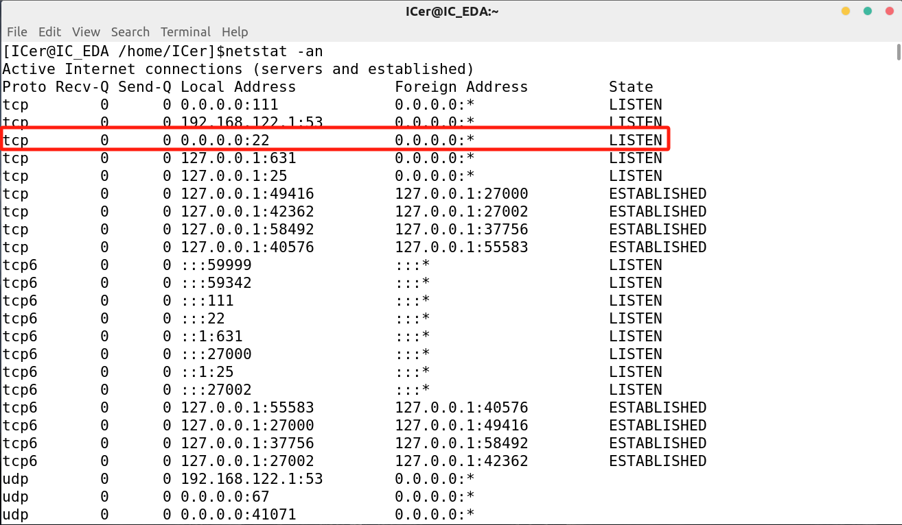

参考链接：[link1](https://www.cnblogs.com/niuben/p/13157291.html)   [link2](https://blog.csdn.net/Naiisii/article/details/117689491)

* ### 将**vmware centos7**网络连接模式改成**NAT**模式


* ### <del>取消VMnet8(NAT模式)的DHCP服务</del>

<p style="color: red;">勘误：Error:关闭DHCP后虚拟机无法连接网络，且无法连接 </p>

选择vmware菜单栏中的【编辑】->【虚拟网络编辑器】, 关闭VMnet8的DHCP服务


* ### 点击上图中的**`NAT设置`**


记住这三个参数，**子网IP(192.168.111.0) ,子网掩码(255.255.255.0),网关IP(192.168.111.2)**。子网IP表示虚拟机IP在192.168.111.0~192.168.111.255之间

### 设置centos7 IP

```shell
$sudo vim /etc/sysconfig/network-scripts/ifcfg-ens33
```

注意文件名不一定是ifcfg-ens33，后面的数字不一定是33

```
BOOTPROTO=static #修改BOOTPROTO为static
ONBOOT=yes #修改为yes
#添加以下：
IPADDR=192.168.111.3
NETMASK=255.255.255.0
GATEWAY=192.168.111.2
```

IPADDR是上述子网IP范围内的一个数即可。

### 设置DNS

```shell
$ sudo vim /etc/resolv.conf
```

```
#添加网关IP
nameserver 192.168.111.2
```

### 设置主机名

```shell
$ vi /etc/sysconfig/network
```

```
# Created by anaconda
NETWORKING=yes
HOSTNAME=IC_EDA
```

```shell
vim /etc/hostname
```

```
IC_EDA
```

因为虚拟机是ICer@IC_EDA,所以此处填IC_EDA

也可使用`hostnamectl`命令查看centos当前hostname

**重启设备**

### 检查22端口是否连接&关防火墙(optional)



```shell
$ systemctl stop firewalld #关闭防火墙
$ systemctl disable firewalld
```

### 设置VMnet8在Windows上的IP属性


IP地址依然是填子网IP范围内的值。192.168.111.0~192.168.111.255

### 使用xshell连接

查看虚拟机IP


**xshell新建会话**


### Vscode ssh

```shell
ssh ICer@192.168.111.3
```

# 解决 CentOS 终端主机名显示-bash-4.2 问题

更新`~/.bashrc`即可

疑问：

１.　**为什么将vmware centos7网络连接模式改成NAT模式？NAT模式与桥接模式的区别在哪？**

NAT模式通过虚拟网络适配器将虚拟机联网，它允许虚拟机共享宿主机的IP地址出去访问外部网络，对外不显示虚拟机的IP地址。而桥接模式则是让虚拟机独立在物理网络中，拥有自己的IP地址，与宿主机在同一网络内，它们之间和其他设备之间可以像真实设备一样进行通信。这取决于用户的需求，如果希望虚拟机像真实设备一样独立存在于网络中，可以选择桥接模式；如果希望虚拟机和宿主机共享网络且对外隐蔽，可以选择NAT模式。

２.　**为什么取消VMnet8(NAT模式)的DHCP服务？**

通常情况下，用户希望控制虚拟机内的网络配置，比如分配固定的IP地址，这样便于管理和访问。如果使用DHCP服务，虚拟机每次启动时可能会获得不同的IP地址，这在某些情况下可能不太方便。

３.　**为什么子网IP是一个范围？为什么BOOTPROTO=static  ONBOOT=yes ？**

子网IP范围指定了一个IP区间，在这个区间内的IP地址可以被分配给网络中的设备。BOOTPROTO=static 表明是使用固定的IP配置，而非通过DHCP自动获取；ONBOOT=yes 指示在系统启动时激活这个网络接口。

４.　**设置DNS的作用是什么？**

DNS（Domain Name System）负责将域名转换为IP地址。在网络设置中配置DNS服务器，可以让虚拟机在访问网络资源时，能够解析和访问到正确的IP地址，它是网络访问的核心部分之一。


### 解决centos ip变动的问题

在windows端连接vmware中的centos时，会发现过一段时间后ip会变化。

这是因为启用了`使用本地DHCP服务将IP地址分配给虚拟机（D）`, 可以限制DHCP ip的范围与更新时间，避免频繁更换ip


