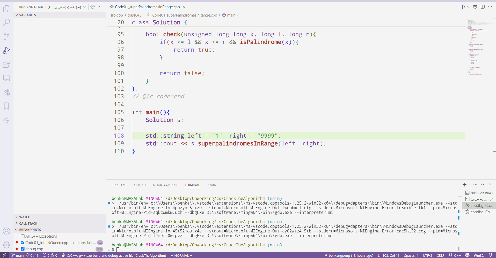

需要在项目文件夹新建`.vscode/`，新建以下两个文件：


* `tasks.json` 用于`C/C++` `build`

```json
{
  "tasks": [
    {
      "type": "cppbuild",
      "label": "C/C++: g++.exe build active file",
        
        //custom the path of your g++
      "command": "D:\\software\\mingw64\\bin\\g++.exe",
      "args": [
        "-fdiagnostics-color=always",
        "-g",
        "${file}",
        // "-I /path/to/includeFile/" //can also set the include file path
        "-o",
        "${fileDirname}\\${fileBasenameNoExtension}.exe" //generate the executable file with the same name
      ],
      "options": {
        "cwd": "${fileDirname}"
      },
      "problemMatcher": ["$gcc"],
      "group": {
        "kind": "build",
        "isDefault": true
      },
      "detail": "Task generated by Debugger."
    }
  ],
  "version": "2.0.0"
}

```


* `launch.json` 用于`C/C++` `Debug`

```json
{
  "configurations": [
    {
      "name": "C/C++: g++.exe build and debug active file",
      "type": "cppdbg",
      "request": "launch",
      "program": "${fileDirname}\\${fileBasenameNoExtension}.exe",
      "args": [],
      "stopAtEntry": false,
      "cwd": "${fileDirname}",
      "environment": [],
      "externalConsole": false,
      "MIMode": "gdb",
        
        //custom the path of gdb.exe
      "miDebuggerPath": "D:\\software\\mingw64\\bin\\gdb.exe",
      "setupCommands": [
        {
          "description": "Enable pretty-printing for gdb",
          "text": "-enable-pretty-printing",
          "ignoreFailures": true
        },
        {
          "description": "Set Disassembly Flavor to Intel",
          "text": "-gdb-set disassembly-flavor intel",
          "ignoreFailures": true
        }
      ],
        
        // build the program before debugging
      "preLaunchTask": "C/C++: g++.exe build active file"
    }
  ],
  "version": "2.0.0"
}

```

