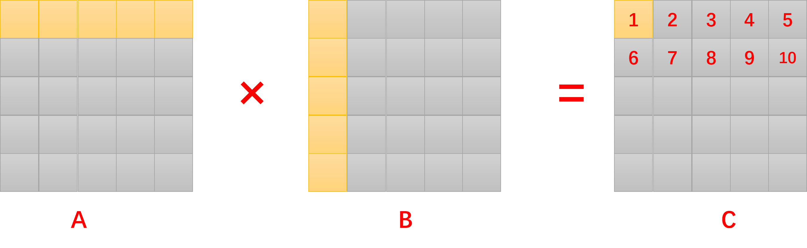

## Sub-group Swizzle分块矩阵乘优化原理分析
### 摘要
矩阵乘法是深度学习、科学计算等应用领域的基础算子，其优化方法是广泛研究的课题。对于大规模矩阵乘法，可以利用线性代数中矩阵分块乘法理论，将大规模矩阵乘法转化为分块矩阵乘。`Sub-group Swizzle Block Matrix Multiplication`是一种将矩阵乘法划分为**子组**，并重新映射**线程块**`threadBlockIdx`，提高`GPU L2 Cache Hit Rate`，以加速分块矩阵乘的优化方法。这种优化方法在`Cutlass`[1], `triton`[2]中被广泛实现，但是目前相关资料对这种优化方法原理的分析较少，甚至存在原理上的错误，相关论坛中的讨论[3]没有定论。本文分析了线程块与SM分配原则、线程块之间的执行顺序，解释了`Sub-group Swizzle Matrix Multiplication`优化`L2 cache hit rate`的原理，

### 引言

#### 分块矩阵乘法


上图表示的是$A \times B = C$的矩阵乘法，假设三个矩阵$A,B，C$为大小相等的方形矩阵，每一个矩阵可以分为$5\times 5$个分块。以下是为每一个分块分配一个`threadblock`并行计算`C`矩阵的`triton`核函数。

```python
@triton.JIT
def matmul_row_wise(...):
    pid = tl.program_id(axis=0)
    grid_n = tl.cdiv(N, BLOCK_SIZE_N)
    pid_m = pid // grid_n
    pid_n = pid % grid_n
    
    #compute every block of matrix C
    .......
```

以上`triton`核函数分配了$5\times5$个线程块，每一个线程块取出`A`矩阵相应的**分块行**(`a row of blocks in A`)，与B矩阵相应的分块列(`a column of blocks in B`)，计算得到`C`矩阵对应的一个分块。`threadblockIdx`(`Triton中称为Program Idx`)按照列主序(`row-wise`)分布。但是，这种算法的`L2 cache hit rate`不高，当$B$矩阵列数$N$较大时，`L2 cache`命中率较低。


#### Sub-group Swizzle分块矩阵乘

`Sub-group Swizzle Block Matmul`分为两步：①将多个**分块行**分为一个`sub-group`；②更改`threadblockIdx`在结果矩阵`C`上的排列顺序。

![[sub-group swizzle matmul.png]](images/sub-group swizzle matmul.png)

如图二所示，在一个分组中，`threadblockIdx`按照如图所示的折线分布。例如在一个大小为2的分组中，`threadblockIdx`按照`(0,0)，(1,0)，(0,1)，(1,1)`的顺序递增，在下一个分组中，`threadblockIdx`按照`(2,0),(3,0),(2,1),(3,1)`的顺序递增。以下为这种算法的`triton`实现：

```python
@triton.jit
def matmul_kernel_group_col_wise(
        # Pointers to matrices
        a_ptr, b_ptr, c_ptr,M, N, K,stride_am, stride_ak,stride_bk, stride_bn, 
        stride_cm, stride_cn,
        # Meta-parameters
        BLOCK_SIZE_M: tl.constexpr, BLOCK_SIZE_N: tl.constexpr, BLOCK_SIZE_K: tl.constexpr,  #
        GROUP_SIZE_M: tl.constexpr,  #
        ACTIVATION: tl.constexpr  #
):
    pid = tl.program_id(axis=0)
    num_pid_m = tl.cdiv(M, BLOCK_SIZE_M)
    num_pid_n = tl.cdiv(N, BLOCK_SIZE_N)
    num_pid_in_group = GROUP_SIZE_M * num_pid_n
    group_id = pid // num_pid_in_group
    first_pid_m = group_id * GROUP_SIZE_M
    group_size_m = min(num_pid_m - first_pid_m, GROUP_SIZE_M)
    pid_m = first_pid_m + ((pid % num_pid_in_group) % group_size_m)
    pid_n = (pid % num_pid_in_group) // group_size_m
    
    #computer every block.......
```

基于分组的`swizzle` `threadblockIdx`映射方式能够提高`L2 cache`命中率。然而，没有相关材料论述其中的原理。材料[2]认为线程块之间是严格串行的，因此能够复用部分数据。但在`CUDA`编程模型中，所有线程块之间并不是严格串行的，线程块之间的执行顺序由`GPU SM Scheduler`和硬件资源所影响，存在较为复杂的关系。接下来将展开优化原理分析。


#### 原理分析

##### ThreadBlock与SM映射关系

GPU按照`ThreadBlockIdx`顺序映射到`SM(Stream Mutliprocessor)`，占满所有SM后，剩余的`threadblock`等待`SM`资源的释放，一旦SM空闲，则分配到该SM上。使用如下设备端代码可以获取每一个`threadblock`对应的`SM`的索引，从而逆向得到特定GPU上`threadblock`与`SM`的映射关系。
```cpp
__device__ unsigned int smid(void)
{
    unsigned int sm;
    asm("mov.u32  %0, %%smid;" : "=r"(sm));
    return sm;
}
```

例如，`GeForce 4090 GPU`有9个完整的`GPC(Graph Process cluster`(每个GPC含有12个SM)，2个不完整的`GPC`(每个GPC含10个SM)，共$9\times12+2\times10=128$个SM。在实验程序中，由于资源限制，单个`SM`最多同时并行2个`threadblock`(`residency=2`)下图为`GeForce RTX 4090`中`SM`与`threadblock`之间的映射关系。
![[The mapping relationship between SMs and thread blocks on NVIDIA GeForce RTX 4090.png]](images/The mapping relationship between SMs and thread blocks on NVIDIA GeForce RTX 4090.png)
如上图所示，`0~127`号`threadblock`被依次映射到`0,0,2,2,4,4,6,6......126,126`号`SM`上，`128~143`号`threadblock`被依次映射到`1,1,3,3,5,5......15,15`号`SM`上，`144~199`号`threadblock`被依次映射到`17,19......127`号`SM`上，`200~255`号`threadblock`被依次映射到`17,19......127`号`SM`。`threadblockIdx`大于255的`threadblock`等待`SM`资源的释放，一旦`SM`空闲，则将`threadblock`映射到空闲的`SM`上。

我们称第一次调度中，将尽可能多的`threadblock`映射到`SMs`上，占满`SM`，为`the first wave`(第一波调度)[4]。所有SM被占满后，采用贪心调度策略(Greedy Schedule)将`threadblock`映射到`SM`，即一旦有SM空闲，立刻将`threadblock`映射上。使用如下设备端函数测出各线程块发射时间：
```python
__device__ unsigned long long globaltime(void)
{
    unsigned long long time;
    asm("mov.u64  %0, %%globaltimer;" : "=l"(time));
    return time;
}
```
![[the first wave and Greedy Schedule.jpg]](images/the first wave and Greedy Schedule.jpg)

由上图可知，由于GPU SM资源限制，GPU不能同时发射所有的`threadblocks`，因此不同批次发射到`SM`上的`threadblocks`之间存在串行关系。接下来分析不同批次的`threadblock`之间如何通过分组`swizzle`优化`L2 cache`命中率。


##### 不同批次之间线程块访存优化

本节将对`L2 cache`访问进行量化分析，分析案例为：
* 矩阵分块规模`M,K,N = 512, 512, 512`，数据精度为`Fp16`，`BLOCK SIZE M,K,N = 64,64,32`
* `NVIDIA GeForce RTX 4090` `L2 cache`为`72MB`，为便于分析，假设`L2 cache`容量正好能够缓存住256个`threadblock`计算所需的数据量。
* 假设每一批次的所有`threadblock`同时结束。虽然一般来说，矩阵乘法中每个`threadblock`计算的数据量相同，但是各`threadblock`的耗时可能不是严格相等。为便于分析，此处做近似分析，下一节做补充说明。

![[row wise 256blocks.jpg]](images/row wise 256blocks.jpg)
上图展示了按照行主序设置`threadblockIdx`的计算流程：①`C0`表示第一批同时启动的256个`ThreadBlocks`。256个`threadblocks`同时读取`A0(一行分块)`，GPU会将其合并为一次读操作；256个`threadBlocks`一共需要读取`B0(256列分块)`。那么`C0`中256个`threadblocks`完成计算总共需要从`Global Memory`中读257行分块。此时，`A0`和`B0`被缓存在L2 cache中。②`C1`中256个`threadblocks`需要读`A0`和`B1`。`A0`被缓存在L2 Cache中，不需要从Global Memory中读取。`B1`需要从Global Memory读取。C1完成计算需要从Global Memory中读取256行分块(忽略从L2 Cache中读取A0的开销，因为L2 Cache速度远快于Global Memory)。此时A0和B1被缓存在L2 Cache中(B0被替换)。同理，③C2完成计算需要从Global Memory中读取257行分块；④C3完成计算需要从Global Memory中读取257行分块。

综上，4批`threadblocks`完成计算，依次需要从Global Memory读取的数据量：257行分块$\rightarrow$ 256 $\rightarrow$ 257 $\rightarrow$ 256。

![[sub-group swizzle 256 blocks.png]]
上图展示了分组大小为2，按照折线顺序编排`threadblockIdx`的计算流程：①`C0`表示第一批同时启动的256个`ThreadBlocks`。256个`threadblocks`同时读取`A0(一行分块)`，GPU会将其合并为一次读操作；256个`threadBlocks`一共需要读取`B0(256列分块)`。那么`C0`中256个`threadblocks`完成计算总共需要从`Global Memory`中读257行分块。此时，`A0`和`B0`被缓存在L2 cache中。②`C1`中256个`threadblocks`需要读`A1`和`B0`。`B0`被缓存在L2 Cache中，不需要从Global Memory中读取。`A1`需要从Global Memory读取。C1完成计算需要从Global 1行分块(忽略从L2 Cache中读取B0的开销，因为L2 Cache速度远快于Global Memory)。此时A1和B0被缓存在L2 Cache中(A0被替换)。同理，③C2完成计算需要从Global Memory中读取257行分块；④C3完成计算需要从Global Memory中读取1行分块。

综上，4批`threadblocks`完成计算，依次需要从Global Memory读取的数据量：257行分块$\rightarrow$ 1 $\rightarrow$ 257 $\rightarrow$ 1。

由此可见，分组折线编排`threadblockIdx`能够较大地提升`L2 Cache`命中率。

##### 同一批线程块的发射顺序
同一批线程块的发射顺序并不是严格并行的，而是大致上按照`threadblockIdx`的顺序发射(但不是严格顺序)，如下图所示[5]：
![[Time-View of CTA Scheduling Across SMs.png]]
可以得出经验性的结论：让`threadblockIdx`相邻的线程块访问相邻地址的数据，更有可能提高`L2 Cache`命中率。

#### 实验：性能比较

实验环境：
* `NVIDIA GeForce RTX 4090`
* `cuda 12.1`
* `CentOS 7.9`

下图是两种不同的`threadblockIdx`编排顺序的算法性能对比图。当矩阵规模较小时，两种算法性能接近，在大规模矩阵乘时，`sub-group swizzle`比`row-wise`性能大约高2倍。

![[row-wise vs sub-group swizzle.png]](images/row-wise vs sub-group swizzle.png)
`L2 Cache Hit rate`对比：
![[L2 cache hit rate compare.png]]
小规模矩阵乘法中，因为`4090 GPU` L2 Cache足够大(72MB)，能够缓存住所有的数据，两种算法的L2 cache命中率都很高。大规模矩阵乘法中，两种算法有明显差异，`M,K,N=16384`下，两种算法的L2 cache命中率分别为`83.22%, 95.70%`，`M,K,N=32768`规模下分别为`83.28%, 95.64%`。

经过`triton tuning`后，`sub-group swizzle`矩阵乘与`cuBLAS`性能对比图。
![[tuning triton vs cublas.png]](images/tuning triton vs cublas.png)


### 参考文献

<a id="1">[1]</a> https://github.com/NVIDIA/cutlass/blob/main/include/cutlass/gemm/threadblock/threadblock_swizzle.h
[2] https://triton-lang.org/main/getting-started/tutorials/03-matrix-multiplication.html
[3] https://github.com/NVIDIA/cutlass/issues/1017
[4] https://cs.rochester.edu/%7Esree/fermi-tbs/fermi-tbs.html
[5] Yang J, Wen M, Chen D, et al. HyFiSS: A Hybrid Fidelity Stall-Aware Simulator for GPGPUs[C]//2024 57th IEEE/ACM International Symposium on Microarchitecture (MICRO). IEEE, 2024: 168-185.
