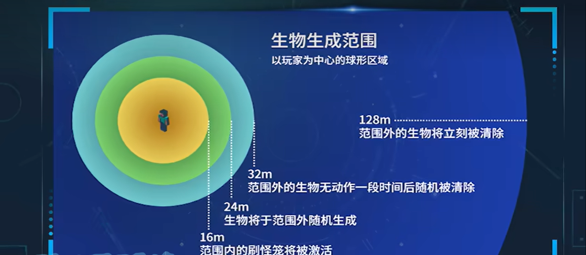
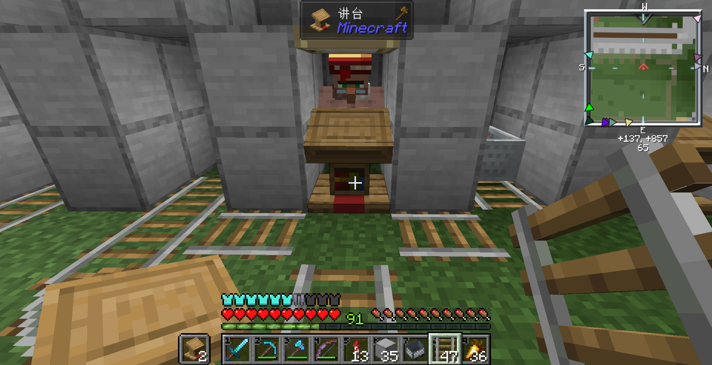

[toc]

待办：

史莱姆农场——下届合金装备——地狱交通——锻造模版——劫掠——凋零信标

### 刷线机

[图酱](https://www.bilibili.com/video/BV12e41157MH/?spm_id_from=333.999.0.0&vd_source=da5120fea3f8bb8d2fe1984a02a9a745)

如果不行，就换个方向，刷线机开口朝北或朝西。(今天看视频，说面朝东边或北边，众说纷纭——2024年6月30日)

### 刷铁机

[川川刷铁机](https://www.bilibili.com/video/BV1Ed4y1L7w9/?share_source=copy_web&vd_source=dafafdec1805b35b4a99583c19bd6bbf)

### 寻找末影珍珠

去地狱的诡异森林(`/locate biome minecraft:warped_forest`)，视线看向小黑，激怒并用船困住小黑。

[狩猎末影珍珠 - 我的世界生存技巧  精准空降到 04:09](https://www.bilibili.com/video/BV1hh411i7dS/?share_source=copy_web&vd_source=dafafdec1805b35b4a99583c19bd6bbf&t=249)

### 小黑塔

[经验花不完！！版本通用简单高效小黑塔速成]( https://www.bilibili.com/video/BV1CK421y73M/?share_source=copy_web&vd_source=dafafdec1805b35b4a99583c19bd6bbf)

### 物品运输与分离

[我的世界 川川 物品收集与分类指南-漏斗特性/分类机原理/物品运输/打包机选择/实例演示](https://www.bilibili.com/video/BV1PQ4y1C7Rp/?share_source=copy_web&vd_source=dafafdec1805b35b4a99583c19bd6bbf)

### 村民繁殖

[怎样无限繁殖村民](https://www.bilibili.com/video/BV1JV411a7dB/?share_source=copy_web&vd_source=dafafdec1805b35b4a99583c19bd6bbf)

打开村民繁殖信息：`/track villager breeding`

关闭村民繁殖信息：`/track villager clear`

### 猪人塔

[我的世界：java版猪人塔，无红石，搭一些方块就行](https://www.bilibili.com/video/BV1134y1Y7dE/?share_source=copy_web&vd_source=dafafdec1805b35b4a99583c19bd6bbf) 

图酱的视频中有个点没讲到：猪人塔要建在下界荒地，否则效率会很低或者不刷猪人。

[黑山大叔](https://www.bilibili.com/video/BV1a64y1C7Za/?share_source=copy_web&vd_source=dafafdec1805b35b4a99583c19bd6bbf)

### 村民交易所

如果村民不识别眼前的工作方块，很可能是因为该村民，正在去寻路其他的工作方块而忽视了眼前的工作方块，或者正在有其他的村民识别当前工作方块。解决方法就是切断寻路路径，使该村民寻路范围内只有该工作方块，同时不让其他村民寻路至此工作方块。我一般是用铁轨切断路径。(注意左右两个铁轨要横着摆放才能阻断左右两边的寻路)

### 史莱姆农场

[简易史莱姆农场-川川](https://www.bilibili.com/video/BV1e84y1M7Gf/?spm_id_from=333.337.search-card.all.click&vd_source=da5120fea3f8bb8d2fe1984a02a9a745)

要注意的几个点：

* 沼泽水面已经是$y = 64$了，再向上建时，一定要注意史莱姆刷新的地面$y < 69$（史莱姆刷新高度：50-70）
* 史莱姆最大身高为3，因此墙壁高度为4
* 挂机平台位置要恰当(配合minihud去找)，第一次建的时候挂机点偏高，导致：看似史莱姆刷新的地面包在了128格以内，但岩浆块处死平台在128格外，史莱姆一跳到处死平台，立刻消失。
* 铁傀儡放置也要注意，要让他的头高一点，能让史莱姆与铁傀儡相互看见，造成仇恨。

### 刷沙机

[【建造教程】我的世界大叔牌实用刷沙机保姆级教程](https://www.bilibili.com/video/BV1v3411J7gg/?spm_id_from=333.337.search-card.all.click&vd_source=da5120fea3f8bb8d2fe1984a02a9a745)

上面这个视频的区块加载器有点奇怪，我使用的水星敖的：[地狱门区块加载器](https://www.bilibili.com/video/BV17M4y1G7gZ?p=1&vd_source=da5120fea3f8bb8d2fe1984a02a9a745)

### 远古残骸盾构机

* 远古残骸在$y = 15$ , **区块边界**(F3+G打开区块显示)生成概率最大。
* 个人不喜欢床炸法，会产生大量火焰，处理起来麻烦。
* 可以先手动挖10个，然后做盾构机
* 这个[视频](https://www.bilibili.com/video/BV1p14y1r7TC/?spm_id_from=333.337.search-card.all.click&vd_source=da5120fea3f8bb8d2fe1984a02a9a745)中的盾构机只适合基岩版
* 直接用tnt炸吧(把刷沙机、刷怪塔做了)，挖一条长矿道，隔一段距离放一个tnt，连锁着炸。

