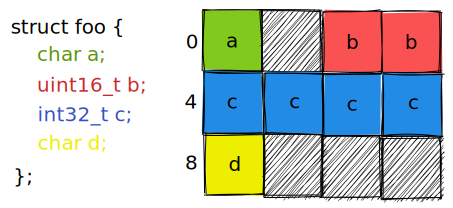
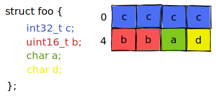

关于内存对齐(`memory alignment`)的笔记

<!-- more -->

#### 计算机读取数据的方式

计算机以**字节块**为粒度进行数据读取。例如，64位的机器中，数据总线宽度为64 bits(8 bytes)，字节块大小为8，它以8 bytes的粒度进行数据读取。若`int64_t x;`的地址为`0x8`(能整除8bytes, 称为64位对齐)，那么机器读取`x`时，会将`0x8~0xF`这个地址范围内的8 bytes读出，从而得到`x`。若`x`的存储地址未对齐(不能整除8, 称为未按8 bytes对齐)，那么机器可能需要进行两次数据读取，才能得到`x`的值。假设`x`存储地址为`0x6`，`x`数据地址范围则为`0x6~0xD`，跨越了`0x0~0x7` `0x8~0xF`这两个字节块，机器读取`x`时，**并不能**够直接读出地址`0x6~0xD`的8 bytes数据。机器需要先读取`0x0~0x7`中的8 bytes，再读取`0x8~0xF`中的8 bytes，最后拼接得到`x`。


内存对齐：变量的地址是变量大小的整数倍($addr = n * sizeof(varible)$)  例如，`double variable`的地址保证是8的整数倍，`int variable`的地址保证是4的整数倍。

保证每一个变量的内存对齐，能够让机器以尽可能少的次数读取到数据。若变量内存未对齐，跨越了多个字节块，计算机就可能需要读取多个字节块


`memory alignment`对性能的影响：

 [🔗code](https://ideone.com/KmWNUo)

```cpp
#include <iostream>
#include <chrono>
#include <vector>
#include <array>

//Force 1-byte alignment
#pragma pack(push, 1)
struct UnalignedData {
	char c;
	double d;
	int i;
};
#pragma pack(pop)

//aligned and padded by compiler
struct AlignedData {
	double d;
	int i;
	char c;
};

void performance_test(){
	const int iterations = static_cast<int>(1e4);
	std::vector<UnalignedData> unaligned(iterations) ;
	std::vector<AlignedData> aligned(iterations);
    std::array<double, iterations> collect;

    //initial
    for(int i = 0; i < iterations; ++i){
        unaligned[i] = {static_cast<char>(i), i * 3.14, i};
        aligned[i] = {i * 3.14, i, static_cast<char>(i)};
    }

	//unaligned
	auto start = std::chrono::high_resolution_clock::now();
	
	for(int i = 0; i < iterations; ++i){
		collect[i] = unaligned[i].d;
	}
	
	auto end = std::chrono::high_resolution_clock::now();
	std::chrono::duration<double, std::milli> unaligned_time(end - start);
	
	//aligned
	start = std::chrono::high_resolution_clock::now();
	for(int i = 0; i < iterations; ++i){
		collect[i] = aligned[i].d;
	}
	end = std::chrono::high_resolution_clock::now();
	std::chrono::duration<double, std::milli> aligned_time(end - start);
	
	std::cout << "Exec Time of Unaligned: " << unaligned_time.count() << "ms" << std::endl;
	std::cout << "Exec Time of Aligned: " << aligned_time.count() << "ms" << std::endl;
	std::cout << "Performance Improvement: " << (unaligned_time.count() / aligned_time.count() -1)*100 << "%" << std::endl;
}
int main(){	
	performance_test();
	return 0;
}

```

> Exec Time of Unaligned: 0.000185ms
> Exec Time of Aligned: 7.2e-05ms
> Performance Improvement: 156.944%

#### struct对齐

当一个结构体内有不同的数据类型时，如何保证所有的变量内存对齐？

编译器通过加入`pad`实现内存对齐：



```cpp
#include<iostream>
#include<cstdint>
#include<cassert>
struct foo{
    char a;
    uint16_t b;//2 bytes
    int32_t c;//4 bytes
    char d;
};

int main(){
    // struct aligned Aligned;

    foo F;
    uintptr_t addr_a = reinterpret_cast<uintptr_t>(&F.a);
    uintptr_t addr_b = reinterpret_cast<uintptr_t>(&F.b);
    uintptr_t addr_c = reinterpret_cast<uintptr_t>(&F.c);
    uintptr_t addr_d = reinterpret_cast<uintptr_t>(&F.d);
    
    std::cout << "Address of F.a is 0x" << std::hex << addr_a << std::endl;

    std::cout << "Address of F.b is 0x" << std::hex << addr_b << std::endl;
    // check whether 2 bytes aligned or not
    assert((addr_b % 2) == 0);

    std::cout << "Address of F.c is 0x" << std::hex << addr_c << std::endl;
    assert((addr_c % 4) == 0);

    std::cout << "Address of F.d is 0x" << std::hex << addr_d << std::endl;

    return 0;
}
```

> Address of F.a is 0x61fdf4
> Address of F.b is 0x61fdf6
> Address of F.c is 0x61fdf8
> Address of F.d is 0x61fdfc

调换`struct`中变量的声明顺序，会改变`padding`的方式：



以上这种`padding`更加节省存储，但是编译器不会主动去调换变量声明顺序去做优化。因此程序员需要手动调整结构体内变量声明顺序以达到最优的`padding`。**一般来说，按照数据类型大小，从大到小声明变量，能达到最佳的`padding`**

```cpp
struct foo{
    char a;
    uint16_t b;//2 bytes
    int32_t c;//4 bytes
    char d;
};
//change the order of variable declartion
struct foo2{
    int32_t a;
    uint16_t b;
    char c;
    char d;
};

int main(){

    foo F;
    foo2 F2;
    std::cout << "struct foo's size = " << sizeof(F) << std::endl;
    std::cout << "struct foo2's size = " << sizeof(F2) << std::endl;
}
```

> struct foo's size = 12
> struct foo2's size = 8


#### 禁用编译器padding

`#pragma pack(push 1)` .... `#pragma pack(pop)`

[🔗code](https://www.ideone.com/bK0SWW)

```cpp
#include <stdio.h>

// 默认对齐的结构体
struct AlignedStruct {
    char a;      // 1 字节
    int b;       // 4 字节（对齐要求 4）
    double c;    // 8 字节（对齐要求 8）
};

// 紧凑对齐（取消填充）
#pragma pack(push, 1)
struct PackedStruct {
    char a;
    int b;
    double c;
};
#pragma pack(pop)

int main() {
    struct AlignedStruct s1;
    struct PackedStruct s2;
    printf("Addresses:\n");
    printf("s1: %p\ns1.a: %p\ns1.b: %p\ns1.c: %p\n", 
           &s1, &s1.a, &s1.b, &s1.c);
    printf("s2: %p\ns2.a: %p\ns2.b: %p\ns2.c: %p\n", 
           &s2, &s2.a, &s2.b, &s2.c);
    return 0;
}
```


#### Reference

[[1] 10 Things You Should Know About Memory Alignment | ncmiller.dev](https://ncmiller.dev/memory-alignment.html)