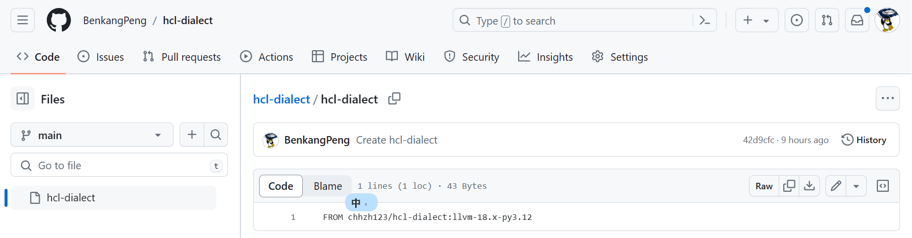

### 使用阿里云拉取海外源镜像

我在使用`docker pull`拉取镜像时，发现拉取小一点的镜像能够成功(例如官方的`hello-world`, `ubuntu`)(用了阿里的加速源)，但拉取大的镜像(`chhzh123/hcl-dialect`,5G)时发现连接超时，无法拉取(挂梯子也不行)，我用的加速源(每个人有不同的阿里加速源)：

```shell
$cat /etc/docker/daemon.json           
{                                                              
  "registry-mirrors": ["https://roywsn4x.mirror.aliyuncs.com"]       
}                                                              
```

因此想在云端把镜像复制到阿里云的镜像服务中，然后从阿里云拉取镜像，试试行得通吗？

参考链接：[docker | 下载外网镜像的几种方式 | lvbibir's Blog](https://www.lvbibir.cn/posts/tech/docker-download-foreign-images/#124-绑定-github-账号)

搜索关键词：利用阿里云FREE镜像仓库构建国外DOCKER镜像

以复制镜像`docker pull chhzh123/hcl-dialect:llvm-18.x-py3.12`为例

* 新建仓库



这里我的仓库名、文件名都设成了`hcl-dialect`。文件`hcl-dialect`称为`dockfile`，其中填写了镜像的来源：

```
FROM chhzh123/hcl-dialect:llvm-18.x-py3.12
```

* 登录[阿里云容器镜像服务](https://cr.console.aliyun.com/cn-hangzhou/instances) , 进入个人实例，创建命名空间，创建镜像仓库

选择从github创建，选择之前创建的github仓库，勾选"海外机器构建"。

添加构建规则如下：


构建成功后就可以用阿里云镜像拉取：


### 出现bug : no space left on device

```shell
$sudo docker pull registry.cn-hangzhou.aliyuncs.com/benkangpeng/hcl-dialect:v1.0.0
v1.0.0: Pulling from benkangpeng/hcl-dialect
9d19ee268e0d: Pull complete 
8e973f6e38f3: Pull complete 
243b884bfc9a: Pull complete 
abed11110b30: Pull complete 
580e3e3a1fe2: Pull complete 
7501df290645: Pull complete 
60073f0f2c27: Extracting [==================================================>]  2.468GB/2.468GB
5fe808d6a777: Download complete 
7e181ac409ff: Download complete 
f6f5dcfec5dd: Download complete 
b3b6f36d2587: Download complete 
failed to register layer: open /root/llvm-project/clang/test/CodeGen/RISCV/rvv-intrinsics-autogenerated/policy/non-overloaded/vloxseg7ei8.c: no space left on device
```

终端显示我的磁盘空间不足。`docker`一般存储在`/var/lib/docker`，查看：

```shell
$df -h /var/lib/docker/
文件系统                 容量  已用  可用 已用% 挂载点
/dev/mapper/centos-root   20G   11G  9.7G   52% /
```

可以看到已经使用了一半，考虑到拉取的镜像就已经有5G了，可能解压缩后更大，猜测问题就出在存储空间上。

使用命令`sudo docker info`可以看到`Docker Root Dir: /var/lib/docker`,这是默认的镜像安装位置。

查看`/home`下还有多少空间(看来是我给虚拟机分配空间时失误了，根目录下空间太少，/home下面太多)

```shell
$df -h /home                                                │
文件系统                 容量  已用  可用 已用% 挂载点                              │
/dev/mapper/centos-home  309G   57G  253G   19% /home
```

**把`docker root`从`/var/lib/docker`改到`/home/docker`**

```shell
$ sudo systemctl stop docker #停止docker服务
$ mkdir -p /home/docker
$ sudo mv /var/lib/docker /home/docker #移动docker数据
# 编辑daemon.json为
$ cat /etc/docker/
$cat /etc/docker/daemon.json          
{             
  "registry-mirrors": ["https://roywsn4x.mirror.aliyuncs.com"],
  "data-root": "/home/docker/"
}


$ sudo systemctl daemon-reload
$ sudo systemctl restart docker
$ sudo docker info | grep "Docker Root Dir" #验证更改
[sudo] ICer 的密码：                                              
 Docker Root Dir: /home/docker                                    
```


